# 📊 ANALYSE APPROFONDIE & PLAN D'IMPLÉMENTATION SYSTÈME D'AFFILIATION
**Projet** : Payhuk SaaS Platform  
**Date** : 25 Octobre 2025  
**Objectif** : Implémenter un système d'affiliation complet et professionnel  
**Analyste** : AI Assistant

---

## 🎯 RÉSUMÉ EXÉCUTIF

### Situation actuelle
Payhuk dispose d'un système de **parrainage basique** (2% de commission fixe) mais n'a **PAS encore** de système d'affiliation où chaque vendeur peut définir ses propres taux d'affiliation par produit.

### Objectif final
Créer un système d'affiliation complet où :
- ✅ Chaque **vendeur** peut définir un **taux d'affiliation personnalisé** pour chaque produit
- ✅ Les **affiliés** peuvent promouvoir des produits et gagner des commissions
- ✅ Tracking complet des ventes via liens d'affiliation uniques
- ✅ Dashboard dédié pour les affiliés avec statistiques et paiements
- ✅ Système de paiement automatique ou manuel des commissions
- ✅ Intégration transparente avec le système de paiement existant (Moneroo)

---

## 📋 PARTIE 1 : ANALYSE ARCHITECTURALE COMPLÈTE

### 1.1 Stack Technique
```yaml
Frontend:
  - Framework: React 18 + TypeScript
  - Build: Vite
  - UI: TailwindCSS + ShadCN UI
  - State: React Query (@tanstack/react-query)
  - Router: React Router v6

Backend:
  - Database: Supabase (PostgreSQL)
  - Authentication: Supabase Auth
  - Storage: Supabase Storage
  - Realtime: Supabase Realtime
  - Functions: Supabase Edge Functions

Paiement:
  - Provider: Moneroo (XOF)
  - Webhooks: Implémentés

Deployment:
  - Hosting: Vercel
  - CI/CD: GitHub Actions (implicite)
```

### 1.2 Structure de la Base de Données (Existante)

#### Tables Principales

**1. `profiles`** - Profils utilisateurs
```sql
- id: UUID (PK)
- user_id: UUID (FK → auth.users) UNIQUE
- display_name: TEXT
- first_name, last_name: TEXT
- avatar_url: TEXT
- referral_code: TEXT UNIQUE           -- ✅ Existant (parrainage)
- referred_by: UUID (FK → auth.users)  -- ✅ Existant
- total_referral_earnings: NUMERIC     -- ✅ Existant
- is_suspended: BOOLEAN
- created_at, updated_at: TIMESTAMP
```

**2. `stores`** - Boutiques des vendeurs
```sql
- id: UUID (PK)
- user_id: UUID (FK → auth.users)
- name: TEXT NOT NULL
- slug: TEXT UNIQUE
- description: TEXT
- logo_url, banner_url: TEXT
- custom_domain: TEXT
- domain_status: TEXT
- is_active: BOOLEAN
- theme_color: TEXT
- contact_email, contact_phone: TEXT
- social_urls: TEXT (facebook, instagram, twitter, linkedin)
- created_at, updated_at: TIMESTAMP
```

**3. `products`** - Produits
```sql
- id: UUID (PK)
- store_id: UUID (FK → stores)
- name: TEXT NOT NULL
- slug: TEXT (UNIQUE per store)
- description: TEXT
- price: DECIMAL
- currency: TEXT (défaut: XOF)
- promotional_price: NUMERIC
- image_url: TEXT
- images: JSONB
- category: TEXT
- category_id: UUID (FK → categories)
- product_type: TEXT
- rating: NUMERIC (0-5)
- reviews_count: INTEGER
- pricing_model: ENUM (one-time, subscription, pay-what-you-want, free)
- is_active: BOOLEAN
- is_draft: BOOLEAN
- downloadable_files: JSONB
- custom_fields: JSONB
- faqs: JSONB
- meta_title, meta_description, og_image: TEXT
- created_at, updated_at: TIMESTAMP
```

**4. `orders`** - Commandes
```sql
- id: UUID (PK)
- store_id: UUID (FK → stores)
- customer_id: UUID (FK → customers)
- order_number: TEXT NOT NULL
- total_amount: NUMERIC
- currency: TEXT
- status: TEXT (pending, completed, cancelled)
- payment_status: TEXT (pending, completed, failed)
- payment_method: TEXT
- payment_type: TEXT (full, percentage, delivery_secured)
- delivery_status: TEXT (pending, shipped, delivered, confirmed)
- notes: TEXT
- created_at, updated_at: TIMESTAMP
```

**5. `payments`** - Paiements
```sql
- id: UUID (PK)
- store_id: UUID (FK → stores)
- order_id: UUID (FK → orders)
- customer_id: UUID (FK → customers)
- payment_method: TEXT
- amount: NUMERIC
- currency: TEXT
- status: TEXT (pending, completed, failed, refunded)
- transaction_id: TEXT
- commission_rate: NUMERIC (défaut: 0.10)      -- ✅ Commission plateforme
- commission_amount: NUMERIC                    -- ✅ Calculé automatiquement
- seller_amount: NUMERIC                        -- ✅ Montant vendeur
- payment_type: TEXT (full, percentage, delivery_secured)
- is_held: BOOLEAN
- notes: TEXT
- created_at, updated_at: TIMESTAMP
```

**6. `platform_commissions`** - Commissions Plateforme (10%)
```sql
- id: UUID (PK)
- payment_id: UUID (FK → payments)
- store_id: UUID (FK → stores)
- order_id: UUID
- product_id: UUID
- total_amount: NUMERIC
- commission_rate: NUMERIC (défaut: 0.10)      -- 10% fixe actuellement
- commission_amount: NUMERIC
- seller_amount: NUMERIC
- status: TEXT (completed)
- created_at, updated_at: TIMESTAMP
```

**7. `referrals`** - Parrainages (Existant)
```sql
- id: UUID (PK)
- referrer_id: UUID (FK → auth.users)     -- Parrain
- referred_id: UUID (FK → auth.users)     -- Filleul
- referral_code: TEXT UNIQUE
- status: TEXT (active, inactive)
- created_at: TIMESTAMP
- UNIQUE(referrer_id, referred_id)
```

**8. `referral_commissions`** - Commissions Parrainage (2%)
```sql
- id: UUID (PK)
- referral_id: UUID (FK → referrals)
- referrer_id: UUID (FK → auth.users)
- referred_id: UUID (FK → auth.users)
- payment_id: UUID (FK → payments)
- order_id: UUID (FK → orders)
- total_amount: NUMERIC
- commission_rate: NUMERIC (défaut: 0.02)    -- 2% fixe actuellement
- commission_amount: NUMERIC
- status: TEXT (pending, completed)
- paid_at: TIMESTAMP
- created_at, updated_at: TIMESTAMP
```

**9. `platform_settings`** - Paramètres Globaux (Singleton)
```sql
- id: UUID (PK) = '00000000-0000-0000-0000-000000000001'
- platform_commission_rate: DECIMAL (défaut: 10.00%)
- referral_commission_rate: DECIMAL (défaut: 2.00%)
- min_withdrawal_amount: INTEGER
- auto_approve_withdrawals: BOOLEAN
- email_notifications: BOOLEAN
- sms_notifications: BOOLEAN
- created_at, updated_at: TIMESTAMP
- updated_by: UUID
```

### 1.3 Système de Paiement Actuel

#### Flux de paiement

```mermaid
graph LR
    A[Client achète produit] --> B[Moneroo Payment]
    B --> C[Webhook Moneroo]
    C --> D[Payments table]
    D --> E{Trigger SQL}
    E --> F[Calcul commission plateforme 10%]
    E --> G[Vérif parrainage vendeur]
    G --> H[Calcul commission parrain 2%]
    F --> I[platform_commissions]
    H --> J[referral_commissions]
```


#### Calcul automatique des commissions (Trigger existant)
**Fichier** : `supabase/migrations/20251007152810_d23dd7ac-3c00-4414-9719-89b794ff587c.sql`

```sql
-- Trigger actif sur table payments
CREATE TRIGGER calculate_payment_commission
BEFORE INSERT ON public.payments
FOR EACH ROW
EXECUTE FUNCTION public.calculate_commission();
```

**Logique actuelle** :
- ✅ Commission plateforme : **10% fixe** sur chaque paiement
- ✅ Commission parrainage : **2% fixe** si le vendeur a été parrainé
- ✅ Insertion automatique dans `platform_commissions` et `referral_commissions`
- ✅ Mise à jour du champ `total_referral_earnings` dans `profiles`

### 1.4 Hooks et Composants Clés

#### Hooks de gestion
```typescript
// Paiements
usePayments()                  // Gestion des paiements par store
useAdvancedPayments()          // Paiements avancés (pourcentage, sécurisé)
usePlatformCommissions()       // Commissions plateforme (admin)

// Parrainage actuel
useReferral()                  // Données parrainage utilisateur
// Page: src/pages/Referrals.tsx
// Admin: src/pages/admin/AdminReferrals.tsx

// Produits
useProducts()                  // Liste produits
useProductManagement()         // CRUD produits
useProductPricing()            // Gestion tarifs

// Stores
useStores()                    // Gestion boutiques
useStore()                     // Boutique active

// Commandes
useOrders()                    // Gestion commandes
useTransactions()              // Transactions Moneroo
```

#### Composants Admin
```
src/pages/admin/
├── AdminDashboard.tsx         -- Tableau de bord admin
├── AdminUsers.tsx             -- Gestion utilisateurs
├── AdminStores.tsx            -- Gestion boutiques
├── AdminProducts.tsx          -- Gestion produits
├── AdminSales.tsx             -- Ventes & revenus
├── AdminReferrals.tsx         -- ✅ Parrainages existants
├── AdminActivity.tsx          -- Logs activité
├── AdminSettings.tsx          -- Paramètres plateforme
├── AdminNotifications.tsx     -- Notifications
└── AdminDisputes.tsx          -- Litiges
```

### 1.5 Systèmes de Sécurité (RLS)

✅ **Row Level Security (RLS)** activé sur toutes les tables  
✅ **Politiques RLS** :
- Vendeurs voient uniquement leurs données
- Admins ont accès complet
- Clients voient leurs commandes
- Sécurité au niveau DB (impossible de contourner)

✅ **Authentification** :
- Supabase Auth avec JWT
- Gestion rôles via `user_roles` table
- Fonction `has_role(user_id, role)` pour vérifications

---

## 📋 PARTIE 2 : DIFFÉRENCES ENTRE PARRAINAGE ET AFFILIATION

### 2.1 Système de PARRAINAGE actuel (✅ Existe déjà)

**Principe** : Recommander la **plateforme** elle-même

| Aspect | Description |
|--------|-------------|
| **Qui ?** | N'importe quel utilisateur (vendeur ou acheteur) |
| **Comment ?** | Partage d'un **code de parrainage unique** (`referral_code`) |
| **Commission** | **2% fixe** sur toutes les ventes du filleul (vendeur parrainé) |
| **Durée** | À vie (tant que le filleul vend) |
| **Objectif** | Faire croître la plateforme (+ d'utilisateurs) |
| **Tables** | `referrals`, `referral_commissions` |
| **Exemple** | Jean parraine Marie → Marie vend 100€ → Jean gagne 2€ |

### 2.2 Système d'AFFILIATION souhaité (❌ À créer)

**Principe** : Promouvoir des **produits spécifiques**

| Aspect | Description |
|--------|-------------|
| **Qui ?** | N'importe qui (même non-inscrits peuvent devenir affiliés) |
| **Comment ?** | Liens d'affiliation uniques **par produit** |
| **Commission** | **Taux variable** défini par le vendeur (ex: 5%, 10%, 20%, 30%) |
| **Durée** | Durée du cookie définie par vendeur (7, 30, 60 jours) |
| **Objectif** | Booster les ventes de produits spécifiques |
| **Tables** | `affiliates`, `affiliate_links`, `affiliate_commissions` (à créer) |
| **Exemple** | Thomas promeut "Formation React" (20% commission) → vend 100€ → gagne 20€ |

### 2.3 Coexistence des deux systèmes

```
┌─────────────────────────────────────────────────────────────┐
│              VENTE D'UN PRODUIT (100 XOF)                   │
└─────────────────────────────────────────────────────────────┘
                          │
                          ▼
        ┌─────────────────────────────────────┐
        │   Commission Plateforme : 10 XOF    │
        │   (10% - fixe)                      │
        └─────────────────────────────────────┘
                          │
                          ▼
              ┌───────────────────────┐
              │ Vendeur reçoit 90 XOF │
              └───────────────────────┘
                          │
          ┌───────────────┼───────────────┐
          ▼                               ▼
┌─────────────────────┐       ┌──────────────────────┐
│ Parrainage Vendeur? │       │ Vente via affiliation?│
│ OUI → 2% = 2 XOF    │       │ OUI → 20% = 20 XOF    │
│ (sur 100 XOF)       │       │ (sur 90 XOF vendeur)  │
└─────────────────────┘       └──────────────────────┘
```

**Important** :
- Commission plateforme (10%) : prise en **PREMIER** sur le montant total
- Commission affiliation : prise sur le **montant vendeur** (après commission plateforme)
- Commission parrainage : prise sur le **montant total** (indépendante)

**Exemple complet** :
```
Prix produit : 100 XOF
Commission plateforme (10%) : 10 XOF
Reste vendeur : 90 XOF

SI vente via affiliation (20%) :
  - Commission affilié : 90 * 20% = 18 XOF
  - Vendeur final : 90 - 18 = 72 XOF

SI vendeur a été parrainé :
  - Commission parrain : 100 * 2% = 2 XOF
  - (Prélevé sur commission plateforme)

Répartition finale :
  - Plateforme : 10 - 2 = 8 XOF
  - Parrain : 2 XOF
  - Affilié : 18 XOF
  - Vendeur : 72 XOF
  Total : 100 XOF ✅
```

---

## 📋 PARTIE 3 : ARCHITECTURE DU SYSTÈME D'AFFILIATION

### 3.1 Nouvelles Tables à Créer

#### Table 1 : `affiliates` (Affiliés)
```sql
CREATE TABLE public.affiliates (
  id UUID PRIMARY KEY DEFAULT gen_random_uuid(),
  user_id UUID REFERENCES auth.users(id) ON DELETE CASCADE,  -- Peut être NULL (affiliés non-inscrits)
  
  -- Informations affilié
  email TEXT NOT NULL UNIQUE,
  first_name TEXT,
  last_name TEXT,
  display_name TEXT,
  avatar_url TEXT,
  
  -- Identifiant unique d'affilié
  affiliate_code TEXT NOT NULL UNIQUE,  -- Ex: "JOHN2024", auto-généré
  
  -- Statistiques
  total_clicks INTEGER DEFAULT 0,
  total_sales INTEGER DEFAULT 0,
  total_revenue NUMERIC DEFAULT 0,            -- Total ventes générées
  total_commission_earned NUMERIC DEFAULT 0,   -- Total commissions gagnées
  total_commission_paid NUMERIC DEFAULT 0,     -- Total commissions payées
  pending_commission NUMERIC DEFAULT 0,        -- Commissions en attente
  
  -- Informations bancaires (pour paiement)
  payment_method TEXT,  -- mobile_money, bank_transfer, paypal
  payment_details JSONB,  -- {phone: "...", iban: "...", etc}
  
  -- Statut
  status TEXT NOT NULL DEFAULT 'active' CHECK (status IN ('active', 'suspended', 'pending')),
  suspension_reason TEXT,
  suspended_at TIMESTAMP WITH TIME ZONE,
  
  -- Métadonnées
  created_at TIMESTAMP WITH TIME ZONE NOT NULL DEFAULT now(),
  updated_at TIMESTAMP WITH TIME ZONE NOT NULL DEFAULT now(),
  last_login_at TIMESTAMP WITH TIME ZONE
);

-- Indexes
CREATE INDEX idx_affiliates_user_id ON public.affiliates(user_id);
CREATE INDEX idx_affiliates_email ON public.affiliates(email);
CREATE INDEX idx_affiliates_code ON public.affiliates(affiliate_code);
CREATE INDEX idx_affiliates_status ON public.affiliates(status);

-- RLS Policies
ALTER TABLE public.affiliates ENABLE ROW LEVEL SECURITY;

CREATE POLICY "Affiliates can view their own data"
  ON public.affiliates FOR SELECT
  USING (auth.uid() = user_id);

CREATE POLICY "Affiliates can update their own data"
  ON public.affiliates FOR UPDATE
  USING (auth.uid() = user_id);

CREATE POLICY "Admins can view all affiliates"
  ON public.affiliates FOR SELECT
  USING (public.has_role(auth.uid(), 'admin'));

CREATE POLICY "Admins can manage all affiliates"
  ON public.affiliates FOR ALL
  USING (public.has_role(auth.uid(), 'admin'));
```

#### Table 2 : `product_affiliate_settings` (Paramètres d'affiliation par produit)
```sql
CREATE TABLE public.product_affiliate_settings (
  id UUID PRIMARY KEY DEFAULT gen_random_uuid(),
  product_id UUID NOT NULL REFERENCES public.products(id) ON DELETE CASCADE UNIQUE,
  store_id UUID NOT NULL REFERENCES public.stores(id) ON DELETE CASCADE,
  
  -- Configuration affiliation
  affiliate_enabled BOOLEAN NOT NULL DEFAULT false,
  commission_rate NUMERIC NOT NULL DEFAULT 0 CHECK (commission_rate >= 0 AND commission_rate <= 100),  -- Pourcentage (0-100)
  commission_type TEXT NOT NULL DEFAULT 'percentage' CHECK (commission_type IN ('percentage', 'fixed')),
  fixed_commission_amount NUMERIC DEFAULT 0,  -- Si commission fixe (ex: 5000 XOF par vente)
  
  -- Durée tracking
  cookie_duration_days INTEGER NOT NULL DEFAULT 30 CHECK (cookie_duration_days > 0),  -- Durée cookie (7, 30, 60, 90 jours)
  
  -- Restrictions
  max_commission_per_sale NUMERIC,  -- Commission max par vente (optionnel)
  min_order_amount NUMERIC DEFAULT 0,  -- Montant min commande pour commission
  
  -- Conditions
  allow_self_referral BOOLEAN DEFAULT false,  -- Permet auto-affiliation (acheter son propre lien)
  require_approval BOOLEAN DEFAULT false,  -- Nécessite approbation vendeur pour devenir affilié
  
  -- Description pour affiliés
  terms_and_conditions TEXT,  -- Conditions spécifiques
  promotional_materials JSONB,  -- Banners, images, textes promo
  
  -- Métadonnées
  created_at TIMESTAMP WITH TIME ZONE NOT NULL DEFAULT now(),
  updated_at TIMESTAMP WITH TIME ZONE NOT NULL DEFAULT now(),
  created_by UUID REFERENCES auth.users(id)
);

-- Indexes
CREATE INDEX idx_product_affiliate_settings_product_id ON public.product_affiliate_settings(product_id);
CREATE INDEX idx_product_affiliate_settings_store_id ON public.product_affiliate_settings(store_id);
CREATE INDEX idx_product_affiliate_settings_enabled ON public.product_affiliate_settings(affiliate_enabled) WHERE affiliate_enabled = true;

-- RLS Policies
ALTER TABLE public.product_affiliate_settings ENABLE ROW LEVEL SECURITY;

CREATE POLICY "Store owners can manage their product affiliate settings"
  ON public.product_affiliate_settings FOR ALL
  USING (
    EXISTS (
      SELECT 1 FROM public.stores
      WHERE stores.id = product_affiliate_settings.store_id
      AND stores.user_id = auth.uid()
    )
  );

CREATE POLICY "Anyone can view affiliate-enabled products"
  ON public.product_affiliate_settings FOR SELECT
  USING (affiliate_enabled = true);

CREATE POLICY "Admins can view all settings"
  ON public.product_affiliate_settings FOR SELECT
  USING (public.has_role(auth.uid(), 'admin'));
```

#### Table 3 : `affiliate_links` (Liens d'affiliation)
```sql
CREATE TABLE public.affiliate_links (
  id UUID PRIMARY KEY DEFAULT gen_random_uuid(),
  affiliate_id UUID NOT NULL REFERENCES public.affiliates(id) ON DELETE CASCADE,
  product_id UUID NOT NULL REFERENCES public.products(id) ON DELETE CASCADE,
  store_id UUID NOT NULL REFERENCES public.stores(id) ON DELETE CASCADE,
  
  -- Lien unique
  link_code TEXT NOT NULL UNIQUE,  -- Ex: "JOHN-REACT-2024" ou hash court
  full_url TEXT NOT NULL,  -- URL complète : https://payhuk.com/products/formation-react?aff=JOHN-REACT-2024
  
  -- Statistiques
  total_clicks INTEGER DEFAULT 0,
  total_sales INTEGER DEFAULT 0,
  total_revenue NUMERIC DEFAULT 0,
  total_commission NUMERIC DEFAULT 0,
  
  -- Métadonnées tracking
  utm_source TEXT,
  utm_medium TEXT,
  utm_campaign TEXT,
  custom_parameters JSONB,  -- Paramètres personnalisés
  
  -- Statut
  status TEXT NOT NULL DEFAULT 'active' CHECK (status IN ('active', 'paused', 'deleted')),
  
  -- Dates
  created_at TIMESTAMP WITH TIME ZONE NOT NULL DEFAULT now(),
  updated_at TIMESTAMP WITH TIME ZONE NOT NULL DEFAULT now(),
  last_used_at TIMESTAMP WITH TIME ZONE,
  
  -- Contrainte unique : un affilié ne peut avoir qu'un seul lien par produit
  UNIQUE(affiliate_id, product_id)
);

-- Indexes
CREATE INDEX idx_affiliate_links_affiliate_id ON public.affiliate_links(affiliate_id);
CREATE INDEX idx_affiliate_links_product_id ON public.affiliate_links(product_id);
CREATE INDEX idx_affiliate_links_link_code ON public.affiliate_links(link_code);
CREATE INDEX idx_affiliate_links_status ON public.affiliate_links(status);

-- RLS Policies
ALTER TABLE public.affiliate_links ENABLE ROW LEVEL SECURITY;

CREATE POLICY "Affiliates can view their own links"
  ON public.affiliate_links FOR SELECT
  USING (
    EXISTS (
      SELECT 1 FROM public.affiliates
      WHERE affiliates.id = affiliate_links.affiliate_id
      AND affiliates.user_id = auth.uid()
    )
  );

CREATE POLICY "Affiliates can create links for affiliate-enabled products"
  ON public.affiliate_links FOR INSERT
  WITH CHECK (
    EXISTS (
      SELECT 1 FROM public.affiliates
      WHERE affiliates.id = affiliate_links.affiliate_id
      AND affiliates.user_id = auth.uid()
    )
    AND EXISTS (
      SELECT 1 FROM public.product_affiliate_settings
      WHERE product_affiliate_settings.product_id = affiliate_links.product_id
      AND product_affiliate_settings.affiliate_enabled = true
    )
  );

CREATE POLICY "Store owners can view links for their products"
  ON public.affiliate_links FOR SELECT
  USING (
    EXISTS (
      SELECT 1 FROM public.stores
      WHERE stores.id = affiliate_links.store_id
      AND stores.user_id = auth.uid()
    )
  );

CREATE POLICY "Admins can view all links"
  ON public.affiliate_links FOR SELECT
  USING (public.has_role(auth.uid(), 'admin'));
```

#### Table 4 : `affiliate_clicks` (Tracking des clics)
```sql
CREATE TABLE public.affiliate_clicks (
  id UUID PRIMARY KEY DEFAULT gen_random_uuid(),
  affiliate_link_id UUID NOT NULL REFERENCES public.affiliate_links(id) ON DELETE CASCADE,
  affiliate_id UUID NOT NULL REFERENCES public.affiliates(id) ON DELETE CASCADE,
  product_id UUID NOT NULL REFERENCES public.products(id) ON DELETE CASCADE,
  
  -- Informations visiteur
  ip_address INET,
  user_agent TEXT,
  referer_url TEXT,
  country TEXT,
  city TEXT,
  device_type TEXT,  -- mobile, desktop, tablet
  browser TEXT,
  os TEXT,
  
  -- Cookie tracking
  tracking_cookie TEXT,  -- Cookie unique stocké dans navigateur
  cookie_expires_at TIMESTAMP WITH TIME ZONE,
  
  -- Conversion
  converted BOOLEAN DEFAULT false,  -- A mené à une vente ?
  order_id UUID REFERENCES public.orders(id),
  converted_at TIMESTAMP WITH TIME ZONE,
  
  -- Métadonnées
  clicked_at TIMESTAMP WITH TIME ZONE NOT NULL DEFAULT now(),
  created_at TIMESTAMP WITH TIME ZONE NOT NULL DEFAULT now()
);

-- Indexes
CREATE INDEX idx_affiliate_clicks_link_id ON public.affiliate_clicks(affiliate_link_id);
CREATE INDEX idx_affiliate_clicks_affiliate_id ON public.affiliate_clicks(affiliate_id);
CREATE INDEX idx_affiliate_clicks_product_id ON public.affiliate_clicks(product_id);
CREATE INDEX idx_affiliate_clicks_tracking_cookie ON public.affiliate_clicks(tracking_cookie);
CREATE INDEX idx_affiliate_clicks_converted ON public.affiliate_clicks(converted);
CREATE INDEX idx_affiliate_clicks_clicked_at ON public.affiliate_clicks(clicked_at DESC);

-- RLS Policies
ALTER TABLE public.affiliate_clicks ENABLE ROW LEVEL SECURITY;

CREATE POLICY "No direct access to clicks"
  ON public.affiliate_clicks FOR SELECT
  USING (false);  -- Accès uniquement via fonctions/triggers

CREATE POLICY "Admins can view all clicks"
  ON public.affiliate_clicks FOR SELECT
  USING (public.has_role(auth.uid(), 'admin'));
```

#### Table 5 : `affiliate_commissions` (Commissions affiliés)
```sql
CREATE TABLE public.affiliate_commissions (
  id UUID PRIMARY KEY DEFAULT gen_random_uuid(),
  affiliate_id UUID NOT NULL REFERENCES public.affiliates(id) ON DELETE CASCADE,
  affiliate_link_id UUID NOT NULL REFERENCES public.affiliate_links(id) ON DELETE CASCADE,
  product_id UUID NOT NULL REFERENCES public.products(id) ON DELETE CASCADE,
  store_id UUID NOT NULL REFERENCES public.stores(id) ON DELETE CASCADE,
  order_id UUID NOT NULL REFERENCES public.orders(id) ON DELETE CASCADE,
  payment_id UUID REFERENCES public.payments(id) ON DELETE SET NULL,
  
  -- Montants
  order_total NUMERIC NOT NULL,  -- Montant total commande
  commission_base NUMERIC NOT NULL,  -- Base calcul commission (après commission plateforme)
  commission_rate NUMERIC NOT NULL,  -- Taux appliqué (%)
  commission_type TEXT NOT NULL CHECK (commission_type IN ('percentage', 'fixed')),
  commission_amount NUMERIC NOT NULL,  -- Montant commission
  
  -- Statut
  status TEXT NOT NULL DEFAULT 'pending' CHECK (status IN ('pending', 'approved', 'paid', 'rejected', 'cancelled')),
  approved_at TIMESTAMP WITH TIME ZONE,
  approved_by UUID REFERENCES auth.users(id),
  rejected_at TIMESTAMP WITH TIME ZONE,
  rejection_reason TEXT,
  
  -- Paiement
  paid_at TIMESTAMP WITH TIME ZONE,
  paid_by UUID REFERENCES auth.users(id),
  payment_method TEXT,
  payment_reference TEXT,
  payment_proof_url TEXT,
  
  -- Métadonnées
  notes TEXT,
  metadata JSONB,
  created_at TIMESTAMP WITH TIME ZONE NOT NULL DEFAULT now(),
  updated_at TIMESTAMP WITH TIME ZONE NOT NULL DEFAULT now()
);

-- Indexes
CREATE INDEX idx_affiliate_commissions_affiliate_id ON public.affiliate_commissions(affiliate_id);
CREATE INDEX idx_affiliate_commissions_order_id ON public.affiliate_commissions(order_id);
CREATE INDEX idx_affiliate_commissions_status ON public.affiliate_commissions(status);
CREATE INDEX idx_affiliate_commissions_store_id ON public.affiliate_commissions(store_id);
CREATE INDEX idx_affiliate_commissions_created_at ON public.affiliate_commissions(created_at DESC);

-- RLS Policies
ALTER TABLE public.affiliate_commissions ENABLE ROW LEVEL SECURITY;

CREATE POLICY "Affiliates can view their own commissions"
  ON public.affiliate_commissions FOR SELECT
  USING (
    EXISTS (
      SELECT 1 FROM public.affiliates
      WHERE affiliates.id = affiliate_commissions.affiliate_id
      AND affiliates.user_id = auth.uid()
    )
  );

CREATE POLICY "Store owners can view commissions for their products"
  ON public.affiliate_commissions FOR SELECT
  USING (
    EXISTS (
      SELECT 1 FROM public.stores
      WHERE stores.id = affiliate_commissions.store_id
      AND stores.user_id = auth.uid()
    )
  );

CREATE POLICY "Admins can manage all commissions"
  ON public.affiliate_commissions FOR ALL
  USING (public.has_role(auth.uid(), 'admin'));
```

#### Table 6 : `affiliate_withdrawals` (Retraits affiliés)
```sql
CREATE TABLE public.affiliate_withdrawals (
  id UUID PRIMARY KEY DEFAULT gen_random_uuid(),
  affiliate_id UUID NOT NULL REFERENCES public.affiliates(id) ON DELETE CASCADE,
  
  -- Montant
  amount NUMERIC NOT NULL CHECK (amount > 0),
  currency TEXT NOT NULL DEFAULT 'XOF',
  
  -- Méthode de paiement
  payment_method TEXT NOT NULL CHECK (payment_method IN ('mobile_money', 'bank_transfer', 'paypal', 'stripe')),
  payment_details JSONB NOT NULL,  -- {phone: "...", account: "...", etc}
  
  -- Statut
  status TEXT NOT NULL DEFAULT 'pending' CHECK (status IN ('pending', 'processing', 'completed', 'failed', 'cancelled')),
  
  -- Approbation
  approved_at TIMESTAMP WITH TIME ZONE,
  approved_by UUID REFERENCES auth.users(id),
  rejected_at TIMESTAMP WITH TIME ZONE,
  rejection_reason TEXT,
  
  -- Traitement
  processed_at TIMESTAMP WITH TIME ZONE,
  processed_by UUID REFERENCES auth.users(id),
  transaction_reference TEXT,
  proof_url TEXT,
  
  -- Échec
  failed_at TIMESTAMP WITH TIME ZONE,
  failure_reason TEXT,
  
  -- Métadonnées
  notes TEXT,
  admin_notes TEXT,
  created_at TIMESTAMP WITH TIME ZONE NOT NULL DEFAULT now(),
  updated_at TIMESTAMP WITH TIME ZONE NOT NULL DEFAULT now()
);

-- Indexes
CREATE INDEX idx_affiliate_withdrawals_affiliate_id ON public.affiliate_withdrawals(affiliate_id);
CREATE INDEX idx_affiliate_withdrawals_status ON public.affiliate_withdrawals(status);
CREATE INDEX idx_affiliate_withdrawals_created_at ON public.affiliate_withdrawals(created_at DESC);

-- RLS Policies
ALTER TABLE public.affiliate_withdrawals ENABLE ROW LEVEL SECURITY;

CREATE POLICY "Affiliates can view their own withdrawals"
  ON public.affiliate_withdrawals FOR SELECT
  USING (
    EXISTS (
      SELECT 1 FROM public.affiliates
      WHERE affiliates.id = affiliate_withdrawals.affiliate_id
      AND affiliates.user_id = auth.uid()
    )
  );

CREATE POLICY "Affiliates can create their own withdrawals"
  ON public.affiliate_withdrawals FOR INSERT
  WITH CHECK (
    EXISTS (
      SELECT 1 FROM public.affiliates
      WHERE affiliates.id = affiliate_withdrawals.affiliate_id
      AND affiliates.user_id = auth.uid()
      AND affiliates.status = 'active'
    )
  );

CREATE POLICY "Admins can manage all withdrawals"
  ON public.affiliate_withdrawals FOR ALL
  USING (public.has_role(auth.uid(), 'admin'));
```

### 3.2 Fonctions SQL Nécessaires

#### Fonction 1 : Générer code affilié unique
```sql
CREATE OR REPLACE FUNCTION public.generate_affiliate_code(
  p_first_name TEXT DEFAULT NULL,
  p_last_name TEXT DEFAULT NULL
)
RETURNS TEXT
LANGUAGE plpgsql
SECURITY DEFINER
SET search_path = public
AS $$
DECLARE
  v_code TEXT;
  v_base TEXT;
  v_suffix TEXT;
  v_exists BOOLEAN;
  v_counter INTEGER := 0;
BEGIN
  -- Base du code (prénom + année)
  IF p_first_name IS NOT NULL THEN
    v_base := upper(substring(regexp_replace(p_first_name, '[^a-zA-Z]', '', 'g'), 1, 4));
  ELSE
    v_base := 'AFF';
  END IF;
  
  v_base := v_base || to_char(now(), 'YY');
  
  -- Boucle jusqu'à trouver un code unique
  LOOP
    v_suffix := '';
    IF v_counter > 0 THEN
      v_suffix := lpad(v_counter::text, 3, '0');
    END IF;
    
    v_code := v_base || v_suffix;
    
    -- Vérifier si le code existe déjà
    SELECT EXISTS(SELECT 1 FROM affiliates WHERE affiliate_code = v_code) INTO v_exists;
    
    IF NOT v_exists THEN
      RETURN v_code;
    END IF;
    
    v_counter := v_counter + 1;
    
    -- Sécurité : éviter boucle infinie
    IF v_counter > 999 THEN
      RAISE EXCEPTION 'Impossible de générer un code affilié unique';
    END IF;
  END LOOP;
END;
$$;
```

#### Fonction 2 : Générer lien d'affiliation
```sql
CREATE OR REPLACE FUNCTION public.generate_affiliate_link_code(
  p_affiliate_code TEXT,
  p_product_slug TEXT
)
RETURNS TEXT
LANGUAGE plpgsql
SECURITY DEFINER
SET search_path = public
AS $$
DECLARE
  v_code TEXT;
  v_hash TEXT;
BEGIN
  -- Créer un hash court unique
  v_hash := encode(digest(p_affiliate_code || '-' || p_product_slug || '-' || gen_random_uuid()::text, 'sha256'), 'hex');
  v_code := substring(v_hash, 1, 12);  -- 12 caractères
  
  RETURN upper(v_code);
END;
$$;
```

#### Fonction 3 : Tracker un clic
```sql
CREATE OR REPLACE FUNCTION public.track_affiliate_click(
  p_link_code TEXT,
  p_ip_address TEXT DEFAULT NULL,
  p_user_agent TEXT DEFAULT NULL,
  p_referer_url TEXT DEFAULT NULL
)
RETURNS JSONB
LANGUAGE plpgsql
SECURITY DEFINER
SET search_path = public
AS $$
DECLARE
  v_link affiliate_links%ROWTYPE;
  v_tracking_cookie TEXT;
  v_cookie_expires_at TIMESTAMP;
  v_product_settings product_affiliate_settings%ROWTYPE;
  v_click_id UUID;
BEGIN
  -- Récupérer le lien d'affiliation
  SELECT * INTO v_link
  FROM affiliate_links
  WHERE link_code = p_link_code AND status = 'active';
  
  IF v_link IS NULL THEN
    RETURN jsonb_build_object(
      'success', false,
      'error', 'Invalid affiliate link'
    );
  END IF;
  
  -- Récupérer les paramètres du produit
  SELECT * INTO v_product_settings
  FROM product_affiliate_settings
  WHERE product_id = v_link.product_id;
  
  -- Générer cookie de tracking
  v_tracking_cookie := encode(gen_random_uuid()::text::bytea, 'base64');
  v_cookie_expires_at := now() + (v_product_settings.cookie_duration_days || ' days')::INTERVAL;
  
  -- Enregistrer le clic
  INSERT INTO affiliate_clicks (
    affiliate_link_id,
    affiliate_id,
    product_id,
    ip_address,
    user_agent,
    referer_url,
    tracking_cookie,
    cookie_expires_at
  ) VALUES (
    v_link.id,
    v_link.affiliate_id,
    v_link.product_id,
    p_ip_address::INET,
    p_user_agent,
    p_referer_url,
    v_tracking_cookie,
    v_cookie_expires_at
  ) RETURNING id INTO v_click_id;
  
  -- Incrémenter compteur de clics
  UPDATE affiliate_links
  SET 
    total_clicks = total_clicks + 1,
    last_used_at = now()
  WHERE id = v_link.id;
  
  UPDATE affiliates
  SET total_clicks = total_clicks + 1
  WHERE id = v_link.affiliate_id;
  
  -- Retourner info pour cookie
  RETURN jsonb_build_object(
    'success', true,
    'tracking_cookie', v_tracking_cookie,
    'expires_at', v_cookie_expires_at,
    'product_id', v_link.product_id::text,
    'click_id', v_click_id::text
  );
END;
$$;
```

#### Fonction 4 : Calculer et créer commission affiliation
```sql
CREATE OR REPLACE FUNCTION public.calculate_affiliate_commission()
RETURNS TRIGGER
LANGUAGE plpgsql
SECURITY DEFINER
SET search_path = public
AS $$
DECLARE
  v_affiliate_click affiliate_clicks%ROWTYPE;
  v_affiliate_link affiliate_links%ROWTYPE;
  v_product_settings product_affiliate_settings%ROWTYPE;
  v_commission_base NUMERIC;
  v_commission_amount NUMERIC;
BEGIN
  -- Vérifier si la commande provient d'un clic affilié (via cookie ou paramètre)
  -- On cherche un clic récent non expiré pour ce produit
  SELECT ac.* INTO v_affiliate_click
  FROM affiliate_clicks ac
  WHERE ac.product_id = (
    SELECT oi.product_id
    FROM order_items oi
    WHERE oi.order_id = NEW.id
    LIMIT 1
  )
  AND ac.tracking_cookie IS NOT NULL
  AND ac.cookie_expires_at > now()
  AND ac.converted = false
  ORDER BY ac.clicked_at DESC
  LIMIT 1;
  
  -- Si pas de clic affilié trouvé, rien à faire
  IF v_affiliate_click IS NULL THEN
    RETURN NEW;
  END IF;
  
  -- Récupérer le lien d'affiliation
  SELECT * INTO v_affiliate_link
  FROM affiliate_links
  WHERE id = v_affiliate_click.affiliate_link_id;
  
  -- Récupérer les paramètres d'affiliation du produit
  SELECT * INTO v_product_settings
  FROM product_affiliate_settings
  WHERE product_id = v_affiliate_click.product_id
  AND affiliate_enabled = true;
  
  IF v_product_settings IS NULL THEN
    RETURN NEW;
  END IF;
  
  -- Vérifier le montant minimum
  IF NEW.total_amount < v_product_settings.min_order_amount THEN
    RETURN NEW;
  END IF;
  
  -- Calculer la base de commission (montant vendeur après commission plateforme)
  -- Montant total - commission plateforme (10%)
  v_commission_base := NEW.total_amount * 0.90;
  
  -- Calculer la commission affilié
  IF v_product_settings.commission_type = 'percentage' THEN
    v_commission_amount := v_commission_base * (v_product_settings.commission_rate / 100);
  ELSE
    v_commission_amount := v_product_settings.fixed_commission_amount;
  END IF;
  
  -- Appliquer la commission max si définie
  IF v_product_settings.max_commission_per_sale IS NOT NULL THEN
    v_commission_amount := LEAST(v_commission_amount, v_product_settings.max_commission_per_sale);
  END IF;
  
  -- Créer la commission affilié
  INSERT INTO affiliate_commissions (
    affiliate_id,
    affiliate_link_id,
    product_id,
    store_id,
    order_id,
    order_total,
    commission_base,
    commission_rate,
    commission_type,
    commission_amount,
    status
  ) VALUES (
    v_affiliate_link.affiliate_id,
    v_affiliate_link.id,
    v_affiliate_click.product_id,
    v_affiliate_link.store_id,
    NEW.id,
    NEW.total_amount,
    v_commission_base,
    v_product_settings.commission_rate,
    v_product_settings.commission_type,
    v_commission_amount,
    'pending'  -- En attente validation
  );
  
  -- Marquer le clic comme converti
  UPDATE affiliate_clicks
  SET 
    converted = true,
    order_id = NEW.id,
    converted_at = now()
  WHERE id = v_affiliate_click.id;
  
  -- Mettre à jour les statistiques du lien
  UPDATE affiliate_links
  SET 
    total_sales = total_sales + 1,
    total_revenue = total_revenue + NEW.total_amount,
    total_commission = total_commission + v_commission_amount
  WHERE id = v_affiliate_link.id;
  
  -- Mettre à jour les statistiques de l'affilié
  UPDATE affiliates
  SET 
    total_sales = total_sales + 1,
    total_revenue = total_revenue + NEW.total_amount,
    total_commission_earned = total_commission_earned + v_commission_amount,
    pending_commission = pending_commission + v_commission_amount
  WHERE id = v_affiliate_link.affiliate_id;
  
  RETURN NEW;
END;
$$;

-- Trigger sur table orders (après insert)
CREATE TRIGGER track_affiliate_order
AFTER INSERT ON public.orders
FOR EACH ROW
EXECUTE FUNCTION public.calculate_affiliate_commission();
```

---

## 📋 PARTIE 4 : PLAN D'IMPLÉMENTATION ÉTAPE PAR ÉTAPE

### Vue d'ensemble : 10 Étapes Majeures

```
PHASE 1 : INFRASTRUCTURE (Étapes 1-3)
├── Étape 1 : Créer tables + fonctions SQL
├── Étape 2 : Créer types TypeScript
└── Étape 3 : Créer hooks React

PHASE 2 : INTERFACE VENDEUR (Étapes 4-5)
├── Étape 4 : Configuration affiliation par produit
└── Étape 5 : Dashboard affiliés du vendeur

PHASE 3 : INTERFACE AFFILIÉ (Étapes 6-7)
├── Étape 6 : Inscription + Dashboard affilié
└── Étape 7 : Génération liens + Stats

PHASE 4 : TRACKING & CONVERSION (Étape 8)
└── Étape 8 : Tracking clics + Attribution ventes

PHASE 5 : PAIEMENTS (Étape 9)
└── Étape 9 : Système retraits + Paiements

PHASE 6 : ADMINISTRATION (Étape 10)
└── Étape 10 : Panel admin complet
```

---

### ✅ ÉTAPE 1 : CRÉER LA STRUCTURE DATABASE

**Objectif** : Mettre en place toutes les tables SQL et fonctions

#### 1.1 Créer fichier migration
**Fichier** : `supabase/migrations/20251025_affiliate_system_complete.sql`

```sql
-- =========================================================
-- Migration : Système d'affiliation complet
-- Date : 25/10/2025
-- Description : Ajout tables + fonctions pour affiliation
-- =========================================================

-- [COLLER ICI TOUTES LES TABLES DÉFINIES EN PARTIE 3.1]
-- [COLLER ICI TOUTES LES FONCTIONS DÉFINIES EN PARTIE 3.2]
```

#### 1.2 Tester la migration
```bash
# En local (si Supabase CLI installé)
supabase db push

# Ou manuellement via Dashboard Supabase > SQL Editor
# Copier-coller le contenu du fichier et exécuter
```

#### 1.3 Vérifications
```sql
-- Vérifier que toutes les tables existent
SELECT table_name FROM information_schema.tables 
WHERE table_schema = 'public' 
AND table_name LIKE 'affiliate%';

-- Vérifier les politiques RLS
SELECT tablename, policyname FROM pg_policies 
WHERE tablename LIKE 'affiliate%';

-- Vérifier les fonctions
SELECT routine_name FROM information_schema.routines 
WHERE routine_schema = 'public' 
AND routine_name LIKE '%affiliate%';
```

**Résultat attendu** :
- ✅ 6 nouvelles tables créées
- ✅ 4 fonctions créées
- ✅ RLS activé sur toutes les tables
- ✅ Indexes créés

**Durée estimée** : 1 heure

---

### ✅ ÉTAPE 2 : CRÉER TYPES TYPESCRIPT

**Objectif** : Définir tous les types pour TypeScript

#### 2.1 Créer fichier types
**Fichier** : `src/types/affiliate.ts`

```typescript
// =========================================================
// Types pour le système d'affiliation
// Date : 25/10/2025
// =========================================================

export type AffiliateStatus = 'active' | 'suspended' | 'pending';
export type CommissionType = 'percentage' | 'fixed';
export type CommissionStatus = 'pending' | 'approved' | 'paid' | 'rejected' | 'cancelled';
export type WithdrawalStatus = 'pending' | 'processing' | 'completed' | 'failed' | 'cancelled';
export type PaymentMethod = 'mobile_money' | 'bank_transfer' | 'paypal' | 'stripe';
export type LinkStatus = 'active' | 'paused' | 'deleted';

// ==============================================
// AFFILIATE (Affilié)
// ==============================================

export interface Affiliate {
  id: string;
  user_id?: string;
  email: string;
  first_name?: string;
  last_name?: string;
  display_name?: string;
  avatar_url?: string;
  affiliate_code: string;
  
  // Stats
  total_clicks: number;
  total_sales: number;
  total_revenue: number;
  total_commission_earned: number;
  total_commission_paid: number;
  pending_commission: number;
  
  // Payment info
  payment_method?: PaymentMethod;
  payment_details?: Record<string, any>;
  
  // Status
  status: AffiliateStatus;
  suspension_reason?: string;
  suspended_at?: string;
  
  // Dates
  created_at: string;
  updated_at: string;
  last_login_at?: string;
}

// ==============================================
// PRODUCT AFFILIATE SETTINGS
// ==============================================

export interface ProductAffiliateSettings {
  id: string;
  product_id: string;
  store_id: string;
  
  // Configuration
  affiliate_enabled: boolean;
  commission_rate: number;
  commission_type: CommissionType;
  fixed_commission_amount?: number;
  
  // Tracking
  cookie_duration_days: number;
  
  // Restrictions
  max_commission_per_sale?: number;
  min_order_amount: number;
  allow_self_referral: boolean;
  require_approval: boolean;
  
  // Content
  terms_and_conditions?: string;
  promotional_materials?: Record<string, any>;
  
  // Dates
  created_at: string;
  updated_at: string;
  created_by?: string;
  
  // Relations (optionnel)
  product?: {
    id: string;
    name: string;
    slug: string;
    price: number;
    image_url?: string;
  };
}

// ==============================================
// AFFILIATE LINK
// ==============================================

export interface AffiliateLink {
  id: string;
  affiliate_id: string;
  product_id: string;
  store_id: string;
  
  // Link
  link_code: string;
  full_url: string;
  
  // Stats
  total_clicks: number;
  total_sales: number;
  total_revenue: number;
  total_commission: number;
  
  // Tracking
  utm_source?: string;
  utm_medium?: string;
  utm_campaign?: string;
  custom_parameters?: Record<string, any>;
  
  // Status
  status: LinkStatus;
  
  // Dates
  created_at: string;
  updated_at: string;
  last_used_at?: string;
  
  // Relations (optionnel)
  product?: {
    id: string;
    name: string;
    slug: string;
    price: number;
    image_url?: string;
    store?: {
      name: string;
      slug: string;
    };
  };
  affiliate?: {
    display_name?: string;
    affiliate_code: string;
  };
}

// ==============================================
// AFFILIATE CLICK
// ==============================================

export interface AffiliateClick {
  id: string;
  affiliate_link_id: string;
  affiliate_id: string;
  product_id: string;
  
  // Visitor info
  ip_address?: string;
  user_agent?: string;
  referer_url?: string;
  country?: string;
  city?: string;
  device_type?: string;
  browser?: string;
  os?: string;
  
  // Tracking
  tracking_cookie: string;
  cookie_expires_at: string;
  
  // Conversion
  converted: boolean;
  order_id?: string;
  converted_at?: string;
  
  // Dates
  clicked_at: string;
  created_at: string;
}

// ==============================================
// AFFILIATE COMMISSION
// ==============================================

export interface AffiliateCommission {
  id: string;
  affiliate_id: string;
  affiliate_link_id: string;
  product_id: string;
  store_id: string;
  order_id: string;
  payment_id?: string;
  
  // Amounts
  order_total: number;
  commission_base: number;
  commission_rate: number;
  commission_type: CommissionType;
  commission_amount: number;
  
  // Status
  status: CommissionStatus;
  approved_at?: string;
  approved_by?: string;
  rejected_at?: string;
  rejection_reason?: string;
  
  // Payment
  paid_at?: string;
  paid_by?: string;
  payment_method?: string;
  payment_reference?: string;
  payment_proof_url?: string;
  
  // Meta
  notes?: string;
  metadata?: Record<string, any>;
  created_at: string;
  updated_at: string;
  
  // Relations (optionnel)
  product?: {
    name: string;
    image_url?: string;
  };
  affiliate?: {
    display_name?: string;
    email: string;
  };
  order?: {
    order_number: string;
  };
}

// ==============================================
// AFFILIATE WITHDRAWAL
// ==============================================

export interface AffiliateWithdrawal {
  id: string;
  affiliate_id: string;
  
  // Amount
  amount: number;
  currency: string;
  
  // Payment method
  payment_method: PaymentMethod;
  payment_details: Record<string, any>;
  
  // Status
  status: WithdrawalStatus;
  
  // Approval
  approved_at?: string;
  approved_by?: string;
  rejected_at?: string;
  rejection_reason?: string;
  
  // Processing
  processed_at?: string;
  processed_by?: string;
  transaction_reference?: string;
  proof_url?: string;
  
  // Failure
  failed_at?: string;
  failure_reason?: string;
  
  // Notes
  notes?: string;
  admin_notes?: string;
  
  // Dates
  created_at: string;
  updated_at: string;
  
  // Relations (optionnel)
  affiliate?: {
    display_name?: string;
    email: string;
    affiliate_code: string;
  };
}

// ==============================================
// FORMS DATA
// ==============================================

export interface AffiliateRegistrationForm {
  email: string;
  first_name?: string;
  last_name?: string;
  display_name?: string;
  password?: string;
  payment_method?: PaymentMethod;
  payment_details?: Record<string, any>;
}

export interface ProductAffiliateSettingsForm {
  affiliate_enabled: boolean;
  commission_rate: number;
  commission_type: CommissionType;
  fixed_commission_amount?: number;
  cookie_duration_days: number;
  max_commission_per_sale?: number;
  min_order_amount: number;
  allow_self_referral: boolean;
  require_approval: boolean;
  terms_and_conditions?: string;
}

export interface CreateAffiliateLinkForm {
  product_id: string;
  utm_source?: string;
  utm_medium?: string;
  utm_campaign?: string;
}

export interface WithdrawalRequestForm {
  amount: number;
  payment_method: PaymentMethod;
  payment_details: Record<string, any>;
  notes?: string;
}

// ==============================================
// STATS
// ==============================================

export interface AffiliateStats {
  total_clicks: number;
  total_sales: number;
  total_revenue: number;
  total_commission_earned: number;
  total_commission_paid: number;
  pending_commission: number;
  available_for_withdrawal: number;
  conversion_rate: number;
  average_order_value: number;
  average_commission_per_sale: number;
}

export interface ProductAffiliateStats {
  product_id: string;
  product_name: string;
  total_affiliates: number;
  total_clicks: number;
  total_sales: number;
  total_revenue: number;
  total_commission_paid: number;
  conversion_rate: number;
}

export interface StoreAffiliateStats {
  store_id: string;
  total_products_with_affiliate: number;
  total_affiliates: number;
  total_clicks: number;
  total_sales: number;
  total_revenue: number;
  total_commission_paid: number;
}

// ==============================================
// FILTERS
// ==============================================

export interface AffiliateFilters {
  status?: AffiliateStatus;
  search?: string;
  date_from?: string;
  date_to?: string;
}

export interface CommissionFilters {
  status?: CommissionStatus;
  affiliate_id?: string;
  product_id?: string;
  store_id?: string;
  date_from?: string;
  date_to?: string;
}

export interface WithdrawalFilters {
  status?: WithdrawalStatus;
  affiliate_id?: string;
  date_from?: string;
  date_to?: string;
}
```

**Durée estimée** : 30 minutes

---

### ✅ ÉTAPE 3 : CRÉER HOOKS REACT

**Objectif** : Créer tous les hooks personnalisés pour gérer l'affiliation

#### 3.1 Hook : useAffiliates (Gestion affiliés)
**Fichier** : `src/hooks/useAffiliates.ts`

```typescript
import { useState, useEffect } from 'react';
import { supabase } from '@/integrations/supabase/client';
import { useToast } from '@/hooks/use-toast';
import { Affiliate, AffiliateFilters, AffiliateRegistrationForm } from '@/types/affiliate';

export const useAffiliates = (filters?: AffiliateFilters) => {
  const [affiliates, setAffiliates] = useState<Affiliate[]>([]);
  const [loading, setLoading] = useState(true);
  const { toast } = useToast();

  const fetchAffiliates = async () => {
    try {
      setLoading(true);
      
      let query = supabase
        .from('affiliates')
        .select('*')
        .order('created_at', { ascending: false });

      if (filters?.status) {
        query = query.eq('status', filters.status);
      }

      if (filters?.search) {
        query = query.or(`email.ilike.%${filters.search}%,display_name.ilike.%${filters.search}%,affiliate_code.ilike.%${filters.search}%`);
      }

      if (filters?.date_from) {
        query = query.gte('created_at', filters.date_from);
      }

      if (filters?.date_to) {
        query = query.lte('created_at', filters.date_to);
      }

      const { data, error } = await query;

      if (error) throw error;

      setAffiliates(data || []);
    } catch (error: any) {
      toast({
        title: 'Erreur',
        description: error.message,
        variant: 'destructive',
      });
    } finally {
      setLoading(false);
    }
  };

  const registerAffiliate = async (formData: AffiliateRegistrationForm): Promise<Affiliate | null> => {
    try {
      const { data: { user } } = await supabase.auth.getUser();

      // Générer code affilié
      const { data: codeData, error: codeError } = await supabase.rpc('generate_affiliate_code', {
        p_first_name: formData.first_name,
        p_last_name: formData.last_name,
      });

      if (codeError) throw codeError;

      const { data, error } = await supabase
        .from('affiliates')
        .insert({
          user_id: user?.id,
          email: formData.email,
          first_name: formData.first_name,
          last_name: formData.last_name,
          display_name: formData.display_name,
          affiliate_code: codeData,
          payment_method: formData.payment_method,
          payment_details: formData.payment_details,
          status: 'active',
        })
        .select()
        .single();

      if (error) throw error;

      toast({
        title: 'Inscription réussie',
        description: `Votre code affilié : ${data.affiliate_code}`,
      });

      await fetchAffiliates();
      return data;
    } catch (error: any) {
      toast({
        title: 'Erreur',
        description: error.message,
        variant: 'destructive',
      });
      return null;
    }
  };

  const updateAffiliate = async (affiliateId: string, updates: Partial<Affiliate>): Promise<boolean> => {
    try {
      const { error } = await supabase
        .from('affiliates')
        .update(updates)
        .eq('id', affiliateId);

      if (error) throw error;

      toast({
        title: 'Succès',
        description: 'Affilié mis à jour',
      });

      await fetchAffiliates();
      return true;
    } catch (error: any) {
      toast({
        title: 'Erreur',
        description: error.message,
        variant: 'destructive',
      });
      return false;
    }
  };

  const suspendAffiliate = async (affiliateId: string, reason: string): Promise<boolean> => {
    try {
      const { error } = await supabase
        .from('affiliates')
        .update({
          status: 'suspended',
          suspension_reason: reason,
          suspended_at: new Date().toISOString(),
        })
        .eq('id', affiliateId);

      if (error) throw error;

      toast({
        title: 'Succès',
        description: 'Affilié suspendu',
      });

      await fetchAffiliates();
      return true;
    } catch (error: any) {
      toast({
        title: 'Erreur',
        description: error.message,
        variant: 'destructive',
      });
      return false;
    }
  };

  useEffect(() => {
    fetchAffiliates();
  }, [JSON.stringify(filters)]);

  return {
    affiliates,
    loading,
    registerAffiliate,
    updateAffiliate,
    suspendAffiliate,
    refetch: fetchAffiliates,
  };
};
```

#### 3.2 Hook : useProductAffiliateSettings
**Fichier** : `src/hooks/useProductAffiliateSettings.ts`

```typescript
import { useState, useEffect } from 'react';
import { supabase } from '@/integrations/supabase/client';
import { useToast } from '@/hooks/use-toast';
import { ProductAffiliateSettings, ProductAffiliateSettingsForm } from '@/types/affiliate';

export const useProductAffiliateSettings = (productId?: string) => {
  const [settings, setSettings] = useState<ProductAffiliateSettings | null>(null);
  const [loading, setLoading] = useState(true);
  const { toast } = useToast();

  const fetchSettings = async () => {
    if (!productId) {
      setLoading(false);
      return;
    }

    try {
      setLoading(true);

      const { data, error } = await supabase
        .from('product_affiliate_settings')
        .select(`
          *,
          product:products!inner(id, name, slug, price, image_url)
        `)
        .eq('product_id', productId)
        .single();

      if (error && error.code !== 'PGRST116') throw error;

      setSettings(data || null);
    } catch (error: any) {
      toast({
        title: 'Erreur',
        description: error.message,
        variant: 'destructive',
      });
    } finally {
      setLoading(false);
    }
  };

  const createOrUpdateSettings = async (
    productId: string,
    storeId: string,
    formData: ProductAffiliateSettingsForm
  ): Promise<boolean> => {
    try {
      const { data: { user } } = await supabase.auth.getUser();

      const { error } = await supabase
        .from('product_affiliate_settings')
        .upsert({
          product_id: productId,
          store_id: storeId,
          ...formData,
          created_by: user?.id,
        });

      if (error) throw error;

      toast({
        title: 'Succès',
        description: 'Paramètres d\'affiliation enregistrés',
      });

      await fetchSettings();
      return true;
    } catch (error: any) {
      toast({
        title: 'Erreur',
        description: error.message,
        variant: 'destructive',
      });
      return false;
    }
  };

  const toggleAffiliateEnabled = async (productId: string, enabled: boolean): Promise<boolean> => {
    try {
      const { error } = await supabase
        .from('product_affiliate_settings')
        .update({ affiliate_enabled: enabled })
        .eq('product_id', productId);

      if (error) throw error;

      toast({
        title: enabled ? 'Affiliation activée' : 'Affiliation désactivée',
      });

      await fetchSettings();
      return true;
    } catch (error: any) {
      toast({
        title: 'Erreur',
        description: error.message,
        variant: 'destructive',
      });
      return false;
    }
  };

  useEffect(() => {
    fetchSettings();
  }, [productId]);

  return {
    settings,
    loading,
    createOrUpdateSettings,
    toggleAffiliateEnabled,
    refetch: fetchSettings,
  };
};
```

#### 3.3 Hook : useAffiliateLinks
**Fichier** : `src/hooks/useAffiliateLinks.ts`

```typescript
import { useState, useEffect } from 'react';
import { supabase } from '@/integrations/supabase/client';
import { useToast } from '@/hooks/use-toast';
import { AffiliateLink, CreateAffiliateLinkForm } from '@/types/affiliate';

export const useAffiliateLinks = (affiliateId?: string) => {
  const [links, setLinks] = useState<AffiliateLink[]>([]);
  const [loading, setLoading] = useState(true);
  const { toast } = useToast();

  const fetchLinks = async () => {
    if (!affiliateId) {
      setLoading(false);
      return;
    }

    try {
      setLoading(true);

      const { data, error } = await supabase
        .from('affiliate_links')
        .select(`
          *,
          product:products!inner(
            id,
            name,
            slug,
            price,
            image_url,
            store:stores!inner(name, slug)
          ),
          affiliate:affiliates!inner(display_name, affiliate_code)
        `)
        .eq('affiliate_id', affiliateId)
        .order('created_at', { ascending: false });

      if (error) throw error;

      setLinks(data || []);
    } catch (error: any) {
      toast({
        title: 'Erreur',
        description: error.message,
        variant: 'destructive',
      });
    } finally {
      setLoading(false);
    }
  };

  const createLink = async (
    affiliateId: string,
    formData: CreateAffiliateLinkForm
  ): Promise<AffiliateLink | null> => {
    try {
      // Vérifier que le produit a l'affiliation activée
      const { data: settingsData, error: settingsError } = await supabase
        .from('product_affiliate_settings')
        .select('*, product:products!inner(slug, store_id)')
        .eq('product_id', formData.product_id)
        .eq('affiliate_enabled', true)
        .single();

      if (settingsError) throw new Error('Ce produit n\'accepte pas l\'affiliation');

      // Générer le code du lien
      const { data: codeData, error: codeError } = await supabase.rpc('generate_affiliate_link_code', {
        p_affiliate_code: (await supabase.from('affiliates').select('affiliate_code').eq('id', affiliateId).single()).data?.affiliate_code,
        p_product_slug: settingsData.product.slug,
      });

      if (codeError) throw codeError;

      // Générer l'URL complète
      const baseUrl = window.location.origin;
      const productUrl = `${baseUrl}/${settingsData.product.store_id}/products/${settingsData.product.slug}`;
      const fullUrl = `${productUrl}?aff=${codeData}`;

      // Créer le lien
      const { data, error } = await supabase
        .from('affiliate_links')
        .insert({
          affiliate_id: affiliateId,
          product_id: formData.product_id,
          store_id: settingsData.product.store_id,
          link_code: codeData,
          full_url: fullUrl,
          utm_source: formData.utm_source,
          utm_medium: formData.utm_medium,
          utm_campaign: formData.utm_campaign,
        })
        .select()
        .single();

      if (error) throw error;

      toast({
        title: 'Lien créé',
        description: 'Votre lien d\'affiliation est prêt',
      });

      await fetchLinks();
      return data;
    } catch (error: any) {
      toast({
        title: 'Erreur',
        description: error.message,
        variant: 'destructive',
      });
      return null;
    }
  };

  const pauseLink = async (linkId: string): Promise<boolean> => {
    try {
      const { error } = await supabase
        .from('affiliate_links')
        .update({ status: 'paused' })
        .eq('id', linkId);

      if (error) throw error;

      toast({ title: 'Lien mis en pause' });
      await fetchLinks();
      return true;
    } catch (error: any) {
      toast({
        title: 'Erreur',
        description: error.message,
        variant: 'destructive',
      });
      return false;
    }
  };

  const activateLink = async (linkId: string): Promise<boolean> => {
    try {
      const { error } = await supabase
        .from('affiliate_links')
        .update({ status: 'active' })
        .eq('id', linkId);

      if (error) throw error;

      toast({ title: 'Lien activé' });
      await fetchLinks();
      return true;
    } catch (error: any) {
      toast({
        title: 'Erreur',
        description: error.message,
        variant: 'destructive',
      });
      return false;
    }
  };

  useEffect(() => {
    fetchLinks();
  }, [affiliateId]);

  return {
    links,
    loading,
    createLink,
    pauseLink,
    activateLink,
    refetch: fetchLinks,
  };
};
```

#### 3.4 Hook : useAffiliateCommissions
**Fichier** : `src/hooks/useAffiliateCommissions.ts`

```typescript
import { useState, useEffect } from 'react';
import { supabase } from '@/integrations/supabase/client';
import { useToast } from '@/hooks/use-toast';
import { AffiliateCommission, CommissionFilters, AffiliateStats } from '@/types/affiliate';

export const useAffiliateCommissions = (filters?: CommissionFilters) => {
  const [commissions, setCommissions] = useState<AffiliateCommission[]>([]);
  const [stats, setStats] = useState<AffiliateStats | null>(null);
  const [loading, setLoading] = useState(true);
  const { toast } = useToast();

  const fetchCommissions = async () => {
    try {
      setLoading(true);

      let query = supabase
        .from('affiliate_commissions')
        .select(`
          *,
          product:products(name, image_url),
          affiliate:affiliates(display_name, email),
          order:orders(order_number)
        `)
        .order('created_at', { ascending: false });

      if (filters?.status) {
        query = query.eq('status', filters.status);
      }

      if (filters?.affiliate_id) {
        query = query.eq('affiliate_id', filters.affiliate_id);
      }

      if (filters?.product_id) {
        query = query.eq('product_id', filters.product_id);
      }

      if (filters?.store_id) {
        query = query.eq('store_id', filters.store_id);
      }

      if (filters?.date_from) {
        query = query.gte('created_at', filters.date_from);
      }

      if (filters?.date_to) {
        query = query.lte('created_at', filters.date_to);
      }

      const { data, error } = await query;

      if (error) throw error;

      setCommissions(data || []);

      // Calculer les stats
      if (data && data.length > 0) {
        const totalRevenue = data.reduce((sum, c) => sum + Number(c.order_total), 0);
        const totalCommissionEarned = data.reduce((sum, c) => sum + Number(c.commission_amount), 0);
        const totalCommissionPaid = data.filter(c => c.status === 'paid').reduce((sum, c) => sum + Number(c.commission_amount), 0);
        const pendingCommission = data.filter(c => c.status === 'pending' || c.status === 'approved').reduce((sum, c) => sum + Number(c.commission_amount), 0);

        setStats({
          total_clicks: 0, // À calculer séparément
          total_sales: data.length,
          total_revenue: totalRevenue,
          total_commission_earned: totalCommissionEarned,
          total_commission_paid: totalCommissionPaid,
          pending_commission: pendingCommission,
          available_for_withdrawal: totalCommissionEarned - totalCommissionPaid,
          conversion_rate: 0, // À calculer séparément
          average_order_value: totalRevenue / data.length,
          average_commission_per_sale: totalCommissionEarned / data.length,
        });
      }
    } catch (error: any) {
      toast({
        title: 'Erreur',
        description: error.message,
        variant: 'destructive',
      });
    } finally {
      setLoading(false);
    }
  };

  const approveCommission = async (commissionId: string): Promise<boolean> => {
    try {
      const { data: { user } } = await supabase.auth.getUser();

      const { error } = await supabase
        .from('affiliate_commissions')
        .update({
          status: 'approved',
          approved_at: new Date().toISOString(),
          approved_by: user?.id,
        })
        .eq('id', commissionId);

      if (error) throw error;

      toast({ title: 'Commission approuvée' });
      await fetchCommissions();
      return true;
    } catch (error: any) {
      toast({
        title: 'Erreur',
        description: error.message,
        variant: 'destructive',
      });
      return false;
    }
  };

  const rejectCommission = async (commissionId: string, reason: string): Promise<boolean> => {
    try {
      const { error } = await supabase
        .from('affiliate_commissions')
        .update({
          status: 'rejected',
          rejected_at: new Date().toISOString(),
          rejection_reason: reason,
        })
        .eq('id', commissionId);

      if (error) throw error;

      toast({ title: 'Commission rejetée' });
      await fetchCommissions();
      return true;
    } catch (error: any) {
      toast({
        title: 'Erreur',
        description: error.message,
        variant: 'destructive',
      });
      return false;
    }
  };

  const markAsPaid = async (
    commissionId: string,
    paymentMethod: string,
    paymentReference: string
  ): Promise<boolean> => {
    try {
      const { data: { user } } = await supabase.auth.getUser();

      const { error } = await supabase
        .from('affiliate_commissions')
        .update({
          status: 'paid',
          paid_at: new Date().toISOString(),
          paid_by: user?.id,
          payment_method: paymentMethod,
          payment_reference: paymentReference,
        })
        .eq('id', commissionId);

      if (error) throw error;

      toast({ title: 'Commission marquée comme payée' });
      await fetchCommissions();
      return true;
    } catch (error: any) {
      toast({
        title: 'Erreur',
        description: error.message,
        variant: 'destructive',
      });
      return false;
    }
  };

  useEffect(() => {
    fetchCommissions();
  }, [JSON.stringify(filters)]);

  return {
    commissions,
    stats,
    loading,
    approveCommission,
    rejectCommission,
    markAsPaid,
    refetch: fetchCommissions,
  };
};
```

**Autres hooks à créer** :
- `useAffiliateWithdrawals.ts` (Gestion retraits)
- `useAffiliateStats.ts` (Statistiques détaillées)
- `useCurrentAffiliate.ts` (Affilié connecté)

**Durée estimée Étape 3** : 3 heures

---

**FIN DE LA PARTIE 4 - ÉTAPES 1-3 (Infrastructure)**

Les 7 étapes restantes (Interfaces Vendeur, Affilié, Tracking, Paiements, Admin) seront détaillées dans les parties suivantes du document.

---

## 🎯 RÉSUMÉ DES ÉTAPES À VENIR

### PHASE 2 : INTERFACE VENDEUR
- **Étape 4** : Page configuration affiliation par produit
- **Étape 5** : Dashboard affiliés pour le vendeur

### PHASE 3 : INTERFACE AFFILIÉ
- **Étape 6** : Page inscription + Dashboard affilié
- **Étape 7** : Génération liens + Statistiques

### PHASE 4 : TRACKING & CONVERSION
- **Étape 8** : Système tracking clics + Attribution ventes

### PHASE 5 : PAIEMENTS
- **Étape 9** : Système retraits + Paiements commissions

### PHASE 6 : ADMINISTRATION
- **Étape 10** : Panel admin complet

---

**Ce document sera complété avec les 7 étapes restantes après validation de cette première partie.**

